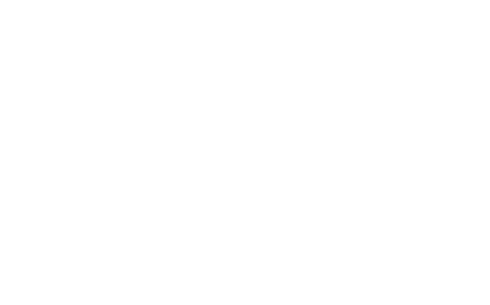

# Cham-Health-Survey

### Features
*   Simple visitor survey to be implemented into www.fitandwell.ch.
*   10 separate question pages with different form input types assess the visitors health status. 
*   From the unser inputs in the forms of those 10 questions a score is calculated via php. Depending upon that score one of 3 possible survey results are displaey on the final page. 
*   User input is validated for every form before its submitted. If necessary, the user is alerted to correct / fill in his answer before he can proceed. 
    

### Links

Link to demo:

https://github.com/vino-12/Cham-Health-Survey.git

### Code Demo

### Authors or Acknowledgments
*  Amir Belbel
*  Chris Thalmann

